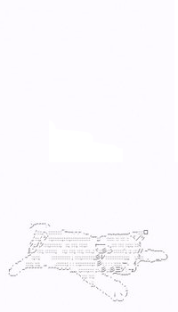

    
    

        <samp>
            what i know.
             
            &nbsp;languages: javascript / typescript; html / css; java / kotlin; python;
             
            &nbsp;databases: mongo; sql
             
             
        </samp>
        <!-- past projects -->
        <samp>
        past projects.
         
        &nbsp;namemc scraper (<a href="https://shibas.dev">shibas.dev</a> / <a href="https://doges.ninja">doges.ninja</a>)
         
        &nbsp;- python / flask, web-scraping, browser automation
         
        &nbsp;minecraft generator core
         
        &nbsp;- kotlin, bukkit api, sql
         
        &nbsp;discord music bot
         
        &nbsp;- typescript, discord.js, web-scraping, sql
        </samp>
         
         
        <!-- hyperlinks -->
        <samp>
            <a href="https://lily.pet">website</a>
            ~
            <a href="https://discord.com/users/712615825965711391/">discord</a>
            ~
            <a href="https://twitter.com/lilysoftpaws">twitter</a>
        </samp>
         
         
        
        
    

